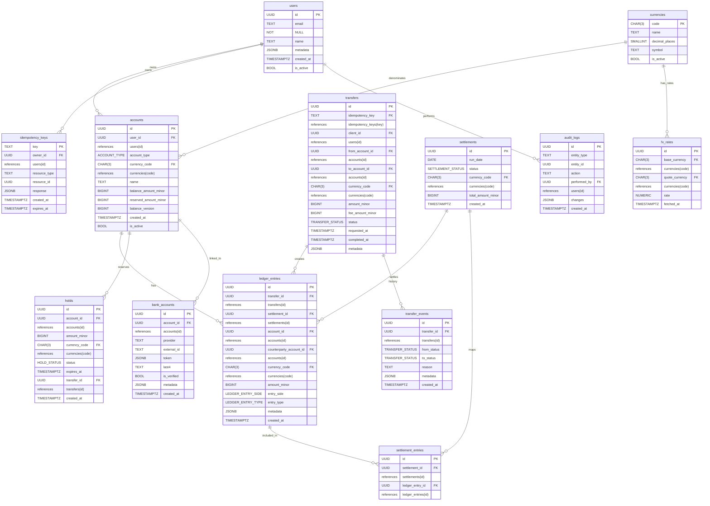

# Money Transfer Database Design

Purpose: Production-ready PostgreSQL schema for a money-transfer system. Properties: ACID transactions, double-entry ledger as source-of-truth, idempotent client operations, multi-currency support, holds/reservations, fee handling, reconciliation-ready audit trail, and safe handling of external payment details (tokenized).

## Assumptions & requirements
- Users own one or more accounts; accounts are denominated in a single currency (ISO 4217, 3-letter).
- Multi-currency transfers supported; cross-currency requires FX conversion (optional).
- Support holds/reservations (pre-authorize funds), captures, refunds, and fee charging.
- Idempotency for client retries (unique key per request).
- High concurrency: updatable cached balances + ledger as source of truth.
- Reconciliation: ledger_entries must sum to account balances; regular background checks.
- Strong audit trail for regulatory requirements; do not store raw PANs (tokenize/encrypt external bank details).
- PostgreSQL features available: uuid generation (pgcrypto/gen_random_uuid), jsonb, enums, partial/functional indexes, partitioning, transactions, FOR UPDATE locks, stored-procedures/triggers.
- Amounts stored as integers in minor units (amount_minor / amount_in_cents). Use BIGINT for amounts; currencies.decimal_places indicates conversion for display.

## ER overview



## Requirements Summary
- Entities: users, currencies, accounts, transfers, ledger_entries (double-entry journal), holds, idempotency_keys, transfer_events (history), bank_accounts, settlements, fx_rates, audit_logs.
- Key relationships: accounts owned by users; transfers reference from/to accounts; ledger_entries reference accounts and (optionally) transfers/settlements; holds reserve funds on accounts; idempotency_keys ensure safe retries.
- Constraints/enforcements: amounts in minor units (BIGINT); transfers.amount_minor > 0; ledger_entries.amount_minor > 0 and entry_side ∈ {debit, credit}; ledger double-entry invariants enforced at application or DB trigger level; currency consistency enforced via triggers during writes.
- Balances: ledger is source-of-truth; accounts contain cached balance_amount_minor + reserved_amount_minor updated transactionally.

## DDL Statements (Postgres)
```sql
-- Requires pgcrypto for gen_random_uuid()
CREATE EXTENSION IF NOT EXISTS pgcrypto;

-- ENUMs
CREATE TYPE transfer_status AS ENUM ('pending','authorized','processing','completed','failed','cancelled','refunded');
CREATE TYPE ledger_entry_side AS ENUM ('debit','credit');
CREATE TYPE ledger_entry_type AS ENUM ('transfer','fee','hold','release','adjustment','settlement','refund');
CREATE TYPE hold_status AS ENUM ('active','consumed','released','expired');
CREATE TYPE account_type AS ENUM ('user','internal','fees','bank','reserve','external');
CREATE TYPE settlement_status AS ENUM ('pending','processing','completed','failed');

-- Currencies
CREATE TABLE currencies (
  code CHAR(3) PRIMARY KEY,
  name TEXT NOT NULL,
  decimal_places SMALLINT NOT NULL DEFAULT 2 CHECK (decimal_places >= 0 AND decimal_places <= 6),
  symbol TEXT,
  is_active BOOLEAN NOT NULL DEFAULT TRUE,
  created_at TIMESTAMPTZ NOT NULL DEFAULT now()
);

-- Users
CREATE TABLE users (
  id UUID PRIMARY KEY DEFAULT gen_random_uuid(),
  email TEXT UNIQUE NOT NULL,
  name TEXT,
  metadata JSONB,
  is_active BOOLEAN NOT NULL DEFAULT TRUE,
  created_at TIMESTAMPTZ NOT NULL DEFAULT now(),
  updated_at TIMESTAMPTZ NOT NULL DEFAULT now()
);

-- Accounts (cached balances)
CREATE TABLE accounts (
  id UUID PRIMARY KEY DEFAULT gen_random_uuid(),
  user_id UUID REFERENCES users(id) ON DELETE SET NULL,
  account_type account_type NOT NULL DEFAULT 'user',
  currency_code CHAR(3) NOT NULL REFERENCES currencies(code),
  name TEXT,
  balance_amount_minor BIGINT NOT NULL DEFAULT 0,      -- cached balance in minor units
  reserved_amount_minor BIGINT NOT NULL DEFAULT 0,     -- holds/reservations
  balance_version BIGINT NOT NULL DEFAULT 0,           -- optimistic concurrency
  is_active BOOLEAN NOT NULL DEFAULT TRUE,
  created_at TIMESTAMPTZ NOT NULL DEFAULT now(),
  updated_at TIMESTAMPTZ NOT NULL DEFAULT now(),
  CHECK (reserved_amount_minor >= 0)
);

-- Idempotency keys
CREATE TABLE idempotency_keys (
  key TEXT PRIMARY KEY,
  owner_id UUID REFERENCES users(id) ON DELETE SET NULL,
  resource_type TEXT,
  resource_id UUID,
  response JSONB,
  created_at TIMESTAMPTZ NOT NULL DEFAULT now(),
  expires_at TIMESTAMPTZ
);

-- Transfers
CREATE TABLE transfers (
  id UUID PRIMARY KEY DEFAULT gen_random_uuid(),
  idempotency_key TEXT REFERENCES idempotency_keys(key),
  client_id UUID REFERENCES users(id),
  from_account_id UUID REFERENCES accounts(id),
  to_account_id UUID REFERENCES accounts(id),
  amount_minor BIGINT NOT NULL CHECK (amount_minor > 0),
  currency_code CHAR(3) NOT NULL REFERENCES currencies(code),
  fee_amount_minor BIGINT NOT NULL DEFAULT 0 CHECK (fee_amount_minor >= 0),
  status transfer_status NOT NULL DEFAULT 'pending',
  allow_self_transfer BOOLEAN NOT NULL DEFAULT FALSE,
  description TEXT,
  metadata JSONB,
  requested_at TIMESTAMPTZ NOT NULL DEFAULT now(),
  completed_at TIMESTAMPTZ,
  CHECK (from_account_id IS NULL OR to_account_id IS NULL OR from_account_id <> to_account_id OR allow_self_transfer)
);

-- Settlements
CREATE TABLE settlements (
  id UUID PRIMARY KEY DEFAULT gen_random_uuid(),
  run_date DATE,
  status settlement_status NOT NULL DEFAULT 'pending',
  currency_code CHAR(3) NOT NULL REFERENCES currencies(code),
  total_amount_minor BIGINT NOT NULL DEFAULT 0,
  created_at TIMESTAMPTZ NOT NULL DEFAULT now(),
  settled_at TIMESTAMPTZ
);

-- Ledger entries (double-entry lines; amount_minor > 0; use entry_side to indicate debit/credit)
CREATE TABLE ledger_entries (
  id UUID PRIMARY KEY DEFAULT gen_random_uuid(),
  transfer_id UUID REFERENCES transfers(id) ON DELETE SET NULL,
  settlement_id UUID REFERENCES settlements(id) ON DELETE SET NULL,
  account_id UUID NOT NULL REFERENCES accounts(id),
  counterparty_account_id UUID REFERENCES accounts(id),
  currency_code CHAR(3) NOT NULL REFERENCES currencies(code),
  amount_minor BIGINT NOT NULL CHECK (amount_minor > 0),
  entry_side ledger_entry_side NOT NULL,
  entry_type ledger_entry_type NOT NULL,
  description TEXT,
  metadata JSONB,
  created_at TIMESTAMPTZ NOT NULL DEFAULT now()
);

-- Settlement entries mapping
CREATE TABLE settlement_entries (
  id UUID PRIMARY KEY DEFAULT gen_random_uuid(),
  settlement_id UUID NOT NULL REFERENCES settlements(id) ON DELETE CASCADE,
  ledger_entry_id UUID NOT NULL REFERENCES ledger_entries(id) ON DELETE CASCADE,
  created_at TIMESTAMPTZ NOT NULL DEFAULT now(),
  UNIQUE (settlement_id, ledger_entry_id)
);

-- Holds / reservations
CREATE TABLE holds (
  id UUID PRIMARY KEY DEFAULT gen_random_uuid(),
  account_id UUID NOT NULL REFERENCES accounts(id),
  amount_minor BIGINT NOT NULL CHECK (amount_minor > 0),
  currency_code CHAR(3) NOT NULL REFERENCES currencies(code),
  status hold_status NOT NULL DEFAULT 'active',
  expires_at TIMESTAMPTZ,
  transfer_id UUID REFERENCES transfers(id),
  created_by UUID REFERENCES users(id),
  created_at TIMESTAMPTZ NOT NULL DEFAULT now()
);

-- Transfer state history / events
CREATE TABLE transfer_events (
  id UUID PRIMARY KEY DEFAULT gen_random_uuid(),
  transfer_id UUID NOT NULL REFERENCES transfers(id) ON DELETE CASCADE,
  from_status transfer_status,
  to_status transfer_status,
  reason TEXT,
  metadata JSONB,
  performed_by UUID REFERENCES users(id),
  created_at TIMESTAMPTZ NOT NULL DEFAULT now()
);

-- Bank / external accounts (do not store raw PAN; store token/pointer)
CREATE TABLE bank_accounts (
  id UUID PRIMARY KEY DEFAULT gen_random_uuid(),
  account_id UUID REFERENCES accounts(id),
  provider TEXT,
  external_id TEXT,
  token JSONB,         -- tokenized/encrypted payload or pointer to vault
  last4 TEXT,
  country CHAR(2),
  currency_code CHAR(3) REFERENCES currencies(code),
  is_verified BOOLEAN NOT NULL DEFAULT FALSE,
  metadata JSONB,
  created_at TIMESTAMPTZ NOT NULL DEFAULT now()
);

-- FX rates (optional)
CREATE TABLE fx_rates (
  id UUID PRIMARY KEY DEFAULT gen_random_uuid(),
  base_currency CHAR(3) NOT NULL REFERENCES currencies(code),
  quote_currency CHAR(3) NOT NULL REFERENCES currencies(code),
  rate NUMERIC(30,18) NOT NULL CHECK (rate > 0),
  source TEXT,
  fetched_at TIMESTAMPTZ NOT NULL DEFAULT now(),
  UNIQUE (base_currency, quote_currency, fetched_at)
);

-- Audit logs
CREATE TABLE audit_logs (
  id UUID PRIMARY KEY DEFAULT gen_random_uuid(),
  entity_type TEXT NOT NULL,
  entity_id UUID,
  action TEXT NOT NULL,
  performed_by UUID REFERENCES users(id),
  changes JSONB,
  ip inet,
  metadata JSONB,
  created_at TIMESTAMPTZ NOT NULL DEFAULT now()
);
```

## Index Recommendations
- accounts: CREATE INDEX ON accounts (user_id); CREATE INDEX ON accounts (currency_code);
- ledger_entries: CREATE INDEX ON ledger_entries (account_id, created_at DESC); CREATE INDEX ON ledger_entries (transfer_id); CREATE INDEX ON ledger_entries (currency_code, created_at);
- transfers: CREATE INDEX ON transfers (idempotency_key); CREATE INDEX ON transfers (client_id, status, requested_at);
- holds: CREATE INDEX ON holds (account_id, status, expires_at);
- idempotency_keys: PRIMARY KEY on key (text) is sufficient; index on owner_id if queries by owner are common.
- transfer_events: INDEX ON transfer_events (transfer_id, created_at);
- audit_logs: INDEX ON audit_logs (entity_type, entity_id, created_at);
- fx_rates: UNIQUE(base_currency, quote_currency, fetched_at); index on (base_currency, quote_currency, fetched_at DESC) for latest.
- Partition ledger_entries by RANGE (created_at) monthly or quarterly for large volume; create indexes per-partition.
Justification: account_id + created_at supports statements and balance lookups; transfer_id supports reconciliation and tracing; idempotency_key uniqueness prevents duplicates.

## Normalization Verification
- Schema normalized to 3NF: no repeating groups, attributes depend on entity keys. Currency metadata in currencies table avoids storing repeated decimal place info. Ledger entries are atomic lines. No transitive dependencies detected in core tables. Intentional denormalization: cached balances on accounts (balance_amount_minor) for read performance — ledger entries remain authoritative and used for reconciliation.

## Scalability Notes
- Ledger volume grows fast — partition ledger_entries by created_at (monthly) or by HASH(account_id) to keep per-partition size manageable.
- Use COPY/bulk ingest for settlement processing where applicable.
- Archive old ledger_entries to a separate historical cluster or cold storage after retention period; keep recent N months online.
- Consider BRIN indexes on created_at for very large partitions.
- Tune autovacuum: ensure frequent vacuum for hot tables (accounts, ledger_entries recent partitions).
- Use connection pooling and limit long-running transactions to avoid retention of old snapshot data.
- Use read replicas for heavy reporting and statement-generation queries; perform reconciliation on replicas where possible.

## Implementation Notes (triggers & procedures)
- Triggers recommended (no implementation shown):
  - ledger_entries BEFORE INSERT/UPDATE: enforce account currency matches ledger.currency (validate currency consistency) and ensure amount_minor > 0.
  - transfer AFTER INSERT/UPDATE: validate that ledger entries for a completed transfer sum to zero per currency (trigger or procedural check). Alternatively, enforce in stored-procedure performing the transfer.
  - accounts BEFORE UPDATE: prevent reserved_amount_minor from becoming negative.
- Stored procedures (recommended):
  - sp_initiate_transfer(idempotency_key, client_id, from_account, to_account, amount, currency, metadata) returns transfer_id — handles idempotency insert/select, hold creation, updates idempotency_keys.resource_id atomically.
  - sp_complete_transfer(transfer_id, fee_account_id, fee_amount) — creates balancing ledger_entries, adjusts cached balances, marks transfer completed, marks holds consumed.
  - sp_refund_transfer(original_transfer_id, reason) — creates refund transfer and reversing ledger entries.
- Use explicit locking order (e.g., lock accounts by id ordering) to avoid deadlocks when locking multiple accounts.
- Use SELECT ... FOR UPDATE on accounts rows (and idempotency_keys row) within a single transaction to ensure atomic updates of cached balances and holds.
- Prefer REPEATABLE READ with explicit FOR UPDATE locking for performance, or SERIALIZABLE for maximum isolation when running cross-check invariants.

---

# Rationale (design choices)
- Double-entry ledger: ledger_entries is the authoritative history for reconciliation, auditing, and regulatory needs. Cached balances on accounts improve read performance for balance queries.
- Amounts as integers: use BIGINT amount_minor (smallest currency unit) to avoid floating point errors. currencies.decimal_places describes conversion to display units.
- Separate currencies table: central place for decimal_places, active flags, and localization/symbols.
- Metadata: jsonb for extensible data (webhook payloads, external references).
- Enums: explicit CREATE TYPE enums reduce invalid states and make code more self-documenting.
- Idempotency: dedicated idempotency_keys table allows global idempotent requests and stores cached responses if desired.

# Detailed table definitions (summary with key constraints & indexes)
(Note: full CREATE TABLE statements provided above. Below are table purposes and primary constraints / indexes.)

- users
  - Purpose: system users (customers/admins).
  - PK: id UUID DEFAULT gen_random_uuid()
  - Unique: email
  - Indexes: email (unique)
  - Notes: metadata jsonb

- currencies
  - Purpose: ISO currencies and formatting decimals.
  - PK: code CHAR(3)
  - Columns: decimal_places SMALLINT (used for conversions)
  - Notes: convert: display = amount_minor / (10 ^ decimal_places)

- accounts
  - Purpose: ledger accounts; one currency per account.
  - PK: id
  - FKs: user_id -> users(id), currency_code -> currencies(code)
  - Important columns: balance_amount_minor BIGINT, reserved_amount_minor BIGINT, balance_version BIGINT (optimistic lock)
  - Indexes: user_id, currency_code
  - Notes: cached balance updated in same transaction as ledger writes.

- transfers
  - Purpose: high-level transfer requests/payloads.
  - PK: id
  - FKs: idempotency_key -> idempotency_keys(key), client_id -> users(id), from_account_id, to_account_id -> accounts(id)
  - Constraints: amount_minor > 0; check to block self-transfer unless allowed.
  - Indexes: idempotency_key, client_id, status

- ledger_entries
  - Purpose: double-entry journal lines (atomic, positive amounts; side indicates sign).
  - PK: id
  - FKs: transfer_id, settlement_id, account_id, currency_code
  - Constraints: amount_minor > 0; entry_side ∈ {debit, credit}
  - Indexes: (account_id, created_at DESC), (transfer_id)
  - Notes: enforce zero-sum per transfer via stored-procedure or trigger.

- holds
  - Purpose: temporary reservations against accounts.
  - PK: id
  - FK: account_id, transfer_id
  - Constraints: amount_minor > 0
  - Indexes: (account_id, status, expires_at)

- idempotency_keys
  - Purpose: store idempotency keys and mapping to created resource.
  - PK: key (text)
  - Columns: owner_id, resource_type, resource_id, response jsonb
  - Usage: INSERT ... ON CONFLICT DO NOTHING and then SELECT to safely handle retries.

- transfer_events
  - Purpose: state change history for transfers.
  - PK: id
  - FK: transfer_id
  - Index: transfer_id

- bank_accounts
  - Purpose: tokenized external payout sources/destinations.
  - PK: id
  - Sensitive storage: token JSONB should hold a pointer or encrypted blob; do NOT store PAN. Use external vault where possible.

- settlements & settlement_entries
  - Purpose: grouping ledger entries into settlement runs.
  - PK: settlements.id, settlement_entries.id
  - Indexes: settlements.run_date, settlement_entries.settlement_id

- fx_rates
  - Purpose: optional store of FX rates used for cross-currency conversions.
  - PK: id
  - Unique: (base_currency, quote_currency, fetched_at)

- audit_logs
  - Purpose: immutable audit trail for important actions.
  - PK: id
  - Index: (entity_type, entity_id)

# Example SQL transaction flows (pseudocode / SQL outlines)

1) Initiate transfer (idempotent) — create transfer + hold
- isolation: READ COMMITTED (use SELECT FOR UPDATE as needed)
- lock: account row(s) FOR UPDATE; idempotency_keys row handled via INSERT ... ON CONFLICT

Pseudocode:
```sql
BEGIN;

-- try to claim idempotency key
INSERT INTO idempotency_keys(key, owner_id, resource_type, created_at)
VALUES (:idem_key, :client_id, 'transfer', now())
ON CONFLICT (key) DO NOTHING;

-- if resource already exists, return it (idempotent)
SELECT resource_id FROM idempotency_keys WHERE key = :idem_key FOR UPDATE;
IF FOUND AND resource_id IS NOT NULL THEN
  -- return existing transfer
  ROLLBACK;
  SELECT * FROM transfers WHERE id = resource_id;
  RETURN;
END IF;

-- lock source account
SELECT balance_amount_minor, reserved_amount_minor FROM accounts WHERE id = :from_account_id FOR UPDATE;

-- check availability
IF (balance_amount_minor - reserved_amount_minor) < :amount THEN
  ROLLBACK; -- insufficient funds
  RAISE 'insufficient_funds';
END IF;

-- create transfer
INSERT INTO transfers(idempotency_key, client_id, from_account_id, to_account_id, amount_minor, currency_code, status, requested_at, metadata)
VALUES (:idem_key, :client_id, :from_account_id, :to_account_id, :amount, :currency, 'pending', now(), :metadata)
RETURNING id INTO new_tid;

-- create hold and increment reserved_amount_minor atomically
INSERT INTO holds(account_id, amount_minor, currency_code, status, transfer_id, created_at)
VALUES (:from_account_id, :amount, :currency, 'active', new_tid, now());

UPDATE accounts
SET reserved_amount_minor = reserved_amount_minor + :amount,
    balance_version = balance_version + 1,
    updated_at = now()
WHERE id = :from_account_id;

-- link idempotency key to resource
UPDATE idempotency_keys SET resource_id = new_tid WHERE key = :idem_key;

COMMIT;
```

2) Execute/complete transfer (capture)
- isolation: REPEATABLE READ or READ COMMITTED with explicit FOR UPDATE
- lock: lock both account rows in deterministic order (min(id), max(id))

Pseudocode:
```sql
BEGIN;

-- lock account rows in deterministic order
SELECT id FROM accounts WHERE id IN (:from_acc, :to_acc) ORDER BY id FOR UPDATE;

-- verify transfer is pending and hold exists (if used)
SELECT * FROM transfers WHERE id = :transfer_id FOR UPDATE;

-- create ledger entries (debit then credit)
INSERT INTO ledger_entries(transfer_id, account_id, counterparty_account_id, currency_code, amount_minor, entry_side, entry_type, created_at)
VALUES
  (:transfer_id, :from_acc, :to_acc, :currency, :amount, 'debit', 'transfer', now()),
  (:transfer_id, :to_acc, :from_acc, :currency, :amount, 'credit', 'transfer', now());

-- optionally apply fees
IF :fee_amount > 0 THEN
  -- fee: debit payer account, credit internal fees account
  INSERT INTO ledger_entries(..., amount_minor=:fee_amount, entry_side='debit', entry_type='fee');
  INSERT INTO ledger_entries(..., account_id=:fees_account, amount_minor=:fee_amount, entry_side='credit', entry_type='fee');
  UPDATE accounts SET balance_amount_minor = balance_amount_minor + :fee_delta ...;
END IF;

-- update cached balances and consume hold
UPDATE accounts SET balance_amount_minor = balance_amount_minor - :amount,
                   reserved_amount_minor = reserved_amount_minor - :amount,
                   balance_version = balance_version + 1, updated_at = now()
WHERE id = :from_acc;

UPDATE accounts SET balance_amount_minor = balance_amount_minor + :amount,
                   balance_version = balance_version + 1, updated_at = now()
WHERE id = :to_acc;

UPDATE holds SET status = 'consumed' WHERE transfer_id = :transfer_id;

UPDATE transfers SET status = 'completed', completed_at = now() WHERE id = :transfer_id;

COMMIT;
```

3) Refund / rollback (create reversing entries)
- create refund transfer that references original_transfer_id in metadata; create ledger_entries reversing original amounts (swap debit/credit), update cached balances.

4) Apply fees
- Fee entries are ledger entries with entry_type='fee'. Fees should be a separate transfer or ledger action linked to the original transfer via metadata. Fees credited to an internal fees account.

5) Reconciliation (periodic)
- Recompute balances from ledger and compare to cached balances:
```sql
SELECT a.id,
       a.currency_code,
       a.balance_amount_minor AS cached,
       COALESCE(SUM(CASE WHEN le.entry_side='credit' THEN le.amount_minor ELSE -le.amount_minor END),0) AS ledger_sum,
       a.balance_amount_minor - COALESCE(SUM(CASE WHEN le.entry_side='credit' THEN le.amount_minor ELSE -le.amount_minor END),0) AS diff
FROM accounts a
LEFT JOIN ledger_entries le ON le.account_id = a.id
GROUP BY a.id, a.balance_amount_minor
HAVING a.balance_amount_minor <> COALESCE(SUM(CASE WHEN le.entry_side='credit' THEN le.amount_minor ELSE -le.amount_minor END),0);
```
- Differences indicate bugs, missed postings, or manual adjustments.

# Indexing & performance notes
- Hot path: balance queries (use cached balance in accounts) and statement queries (ledger_entries with account_id + created_at).
- Partition ledger_entries monthly by created_at; keep index on account_id per partition.
- Consider materialized views for heavy reporting (refresh off-peak).
- Tune autovacuum: aggressive for ledger partitions being inserted to; avoid long-running transactions that prevent VACUUM.
- Provide background job to compact/aggregate old ledger entries into summarized historical records for reporting and archive detailed rows.

# Security, compliance & operational notes
- Do NOT store raw PANs or sensitive bank details. Use tokenization (store token JSON pointing to vault) or encrypted blobs (external key management).
- Use TLS for connections, encryption at rest (DB provider), and role-based access. Limit who can SELECT ledger tables.
- Audit trail: write important events to audit_logs and keep immutable appends.
- Data retention: comply with local regulations; implement purge/archive pipeline.
- Monitoring: track long-running transactions, replication lag, deadlocks, queue lengths for settlement jobs.
- Backups & point-in-time-recovery (PITR) must be enabled; test restores periodically.

# Additional notes
- Migrations: use transactional migrations and backfill processes for balance changes; ensure deployment of triggers/procedures is coordinated with application changes.
- Testing: heavy concurrency tests (multiple parallel transfers, idempotent retries), property-based tests to validate ledger zero-sum invariants.
- Example queries:
  - Current cached balance:
    SELECT balance_amount_minor, reserved_amount_minor, balance_amount_minor - reserved_amount_minor AS available_minor FROM accounts WHERE id = :account_id;
  - Statement (last N days):
    SELECT le.*, t.id AS transfer_id, t.status
    FROM ledger_entries le
    LEFT JOIN transfers t ON t.id = le.transfer_id
    WHERE le.account_id = :account_id
    ORDER BY le.created_at DESC
    LIMIT 100;

Conversion note: display_amount = amount_minor / pow(10, currencies.decimal_places). Use DECIMAL or numeric for client-side formatting.

---

This document contains the schema, choices, DDL and example flows required for a production-ready PostgreSQL-backed money-transfer application.